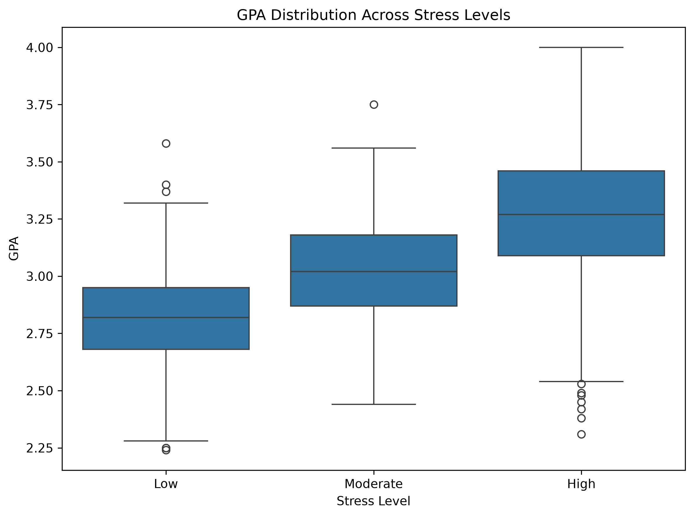
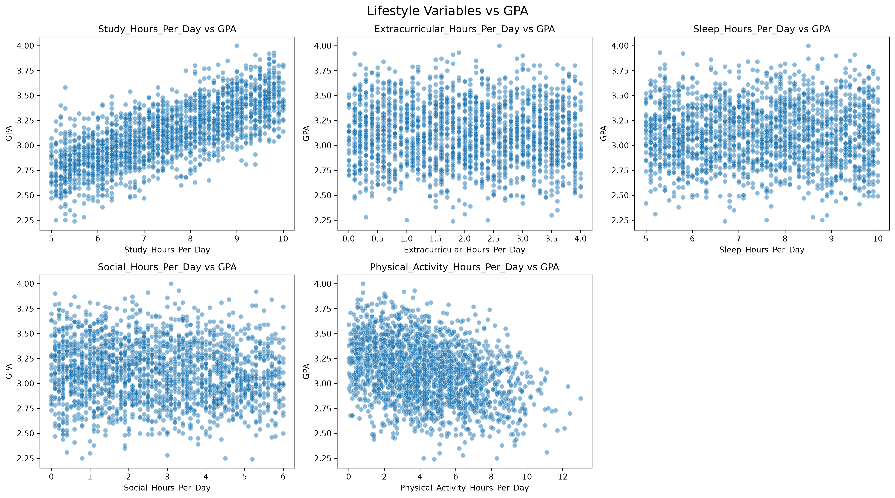
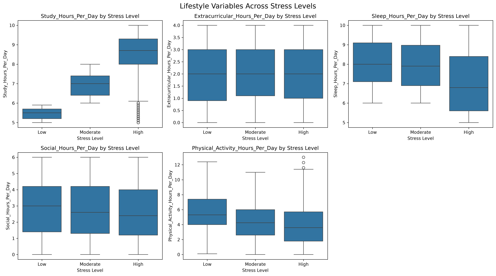
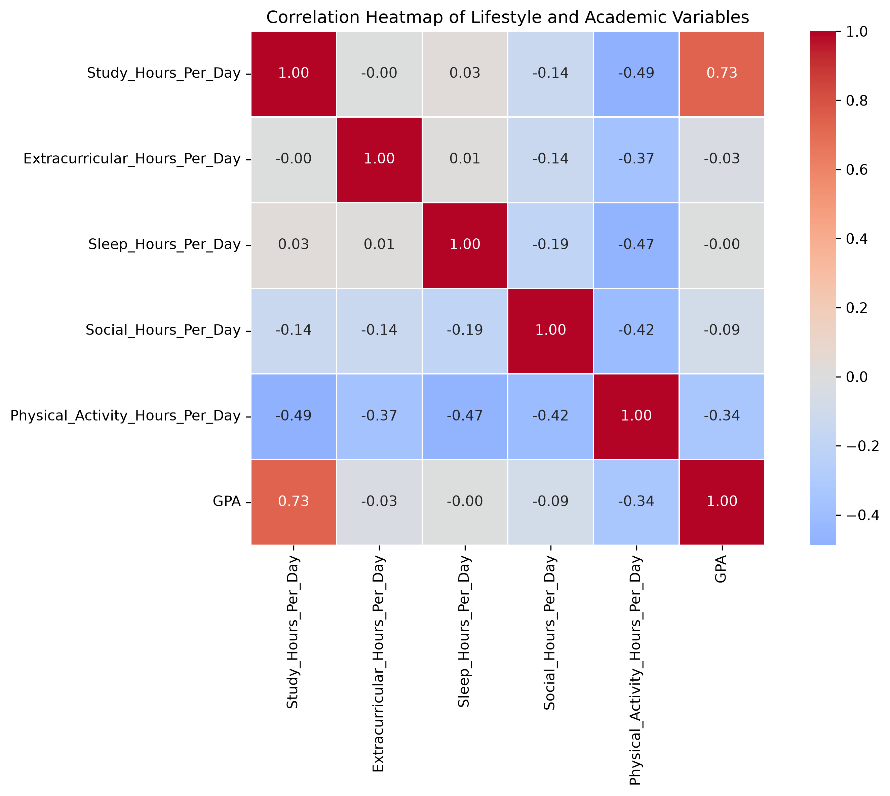
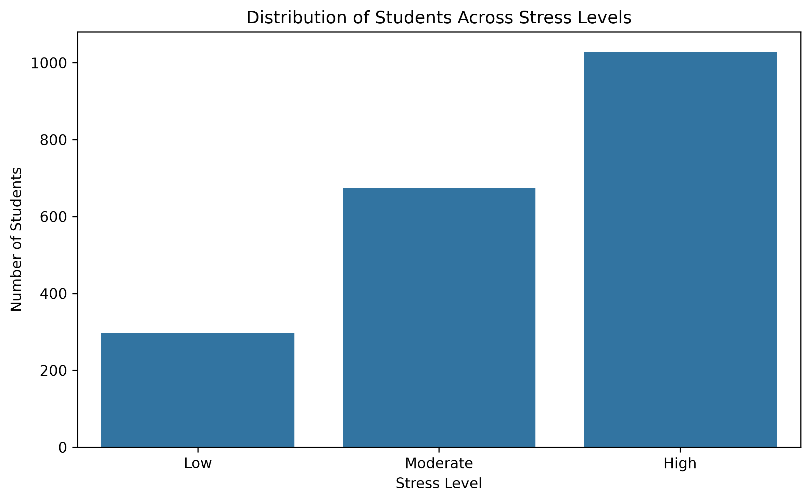
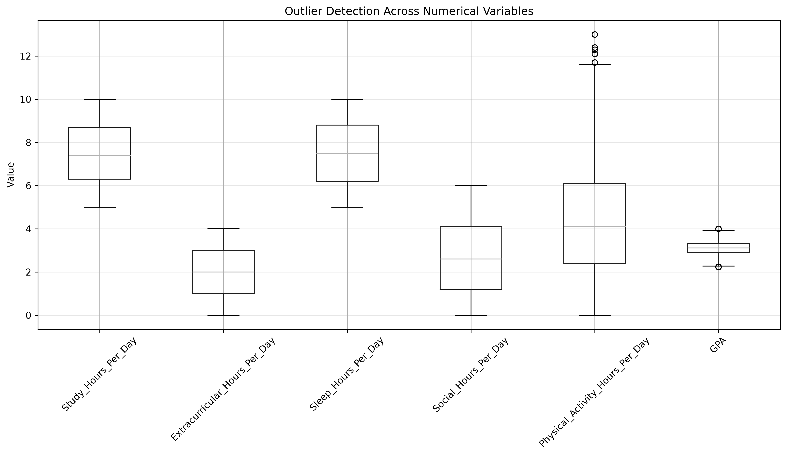

# Student Lifestyle & Academic Performance - Exploratory Data Analysis

## 📌 Project Overview

This project performs an Exploratory Data Analysis (EDA) on student lifestyle and academic performance data.

The objective is to understand how different lifestyle factors such as study hours, sleep, social activities, extracurricular activities, physical activity, and stress levels are associated with students' academic performance measured through GPA.

The analysis uses Python-based data analysis and visualization techniques to identify meaningful patterns, relationships, distributions, and statistical differences within the dataset.

---

## 🎯 Objectives

The main objectives of this project are:

- Analyze student lifestyle patterns.
- Understand the relationship between lifestyle factors and GPA.
- Examine how lifestyle variables differ across stress levels.
- Analyze GPA across different stress-level categories.
- Identify correlations between numerical variables.
- Detect potential statistical outliers.
- Apply statistical tests to support the findings.
- Present the results through clear and meaningful visualizations.

---

## 📂 Project Structure

```text
Student_Lifestyle_Academic_Performance_EDA/
│
├── data/
│   ├── student_lifestyle_dataset.csv
│   └── student_lifestyle_cleaned.csv
│
├── notebooks/
│   └── student_lifestyle_eda.ipynb
│
├── outputs/
│   └── figures/
│       ├── correlation_heatmap.png
│       ├── gpa_across_stress_levels.png
│       ├── lifestyle_variables_vs_gpa.png
│       ├── lifestyle_variables_vs_stress.png
│       ├── outlier_detection.png
│       └── stress_level_distribution.png
│
├── README.md
├── requirements.txt
└── .gitignore
```

---

## 📊 Dataset

The dataset contains information about students' lifestyle habits, stress levels, and academic performance.

### Important Variables

| Variable | Description |
|---|---|
| `Student_ID` | Unique identifier for each student |
| `Study_Hours_Per_Day` | Average number of hours spent studying per day |
| `Extracurricular_Hours_Per_Day` | Average time spent on extracurricular activities |
| `Sleep_Hours_Per_Day` | Average number of hours of sleep per day |
| `Social_Hours_Per_Day` | Average time spent on social activities per day |
| `Physical_Activity_Hours_Per_Day` | Average time spent on physical activity per day |
| `Stress_Level` | Student stress category: Low, Moderate, or High |
| `GPA` | Grade Point Average representing academic performance |

---

## 🛠️ Technologies Used

- **Python**
- **Pandas**
- **NumPy**
- **Matplotlib**
- **Seaborn**
- **SciPy**
- **Jupyter Notebook**
- **Git & GitHub**

---

## 🔍 Exploratory Data Analysis Process

The analysis was performed through the following stages:

### 1. Data Loading

The dataset was loaded using Pandas and inspected to understand its structure, columns, and data types.

### 2. Data Cleaning

The dataset was checked for:

- Missing values
- Duplicate records
- Invalid values
- Incorrect data types
- Potential inconsistencies

The cleaned dataset was saved separately as:

```text
data/student_lifestyle_cleaned.csv
```

### 3. Exploratory Analysis

The distributions and relationships between lifestyle variables, stress levels, and GPA were explored using descriptive statistics and visualizations.

### 4. Correlation Analysis

Pearson correlation was used to examine the relationship between numerical variables.

### 5. Statistical Testing

Statistical tests were applied to determine whether observed differences between stress-level groups were statistically significant.

The Kruskal-Wallis test was used where appropriate.

### 6. Outlier Detection

The Interquartile Range (IQR) method was used to identify potential statistical outliers.

---

## 📈 Key Findings

### Study Hours vs GPA

Study hours showed the strongest positive relationship with GPA among the lifestyle variables analyzed.

The Pearson correlation coefficient was approximately:

```text
r = 0.7345
```

This indicates a strong positive association between study hours and GPA within this dataset.

---

### Physical Activity vs GPA

Physical activity hours showed a negative relationship with GPA:

```text
r = -0.3412
```

This represents a weak-to-moderate negative association in the dataset.

---

### Social Hours vs GPA

Social hours showed a very weak negative association with GPA:

```text
r = -0.0857
```

Although the relationship was statistically significant, its practical strength was very small.

---

### Sleep Hours vs GPA

Sleep hours showed almost no linear relationship with GPA:

```text
r = -0.0043
```

The relationship was not statistically significant.

---

### Extracurricular Hours vs GPA

Extracurricular hours showed a very weak relationship with GPA:

```text
r = -0.0322
```

The relationship was not statistically significant.

---

## 🧠 Lifestyle Variables Across Stress Levels

The analysis showed noticeable differences in several lifestyle variables across Low, Moderate, and High stress groups.

### Study Hours

Average study hours increased across stress categories:

| Stress Level | Average Study Hours |
|---|---:|
| Low | 5.47 |
| Moderate | 6.97 |
| High | 8.39 |

The difference was statistically significant.

### Sleep Hours

Average sleep decreased for the High stress group:

| Stress Level | Average Sleep Hours |
|---|---:|
| Low | 8.06 |
| Moderate | 7.95 |
| High | 7.05 |

The difference was statistically significant.

### Physical Activity

Average physical activity decreased as stress level increased:

| Stress Level | Average Physical Activity Hours |
|---|---:|
| Low | 5.58 |
| Moderate | 4.34 |
| High | 3.96 |

The difference was statistically significant.

### Social Hours

Social activity showed a small decrease across stress levels:

| Stress Level | Average Social Hours |
|---|---:|
| Low | 2.89 |
| Moderate | 2.74 |
| High | 2.63 |

The difference was statistically significant, although the practical effect was small.

### Extracurricular Hours

Extracurricular activity remained relatively similar across stress groups.

The difference was not statistically significant.

---

## 📚 GPA Across Stress Levels

The average GPA increased across the stress categories in this dataset:

| Stress Level | Average GPA |
|---|---:|
| Low | 2.82 |
| Moderate | 3.02 |
| High | 3.26 |

The Kruskal-Wallis test indicated a statistically significant difference in GPA distributions across the stress-level groups.

```text
Kruskal-Wallis H ≈ 620.67
p < 0.001
```

This result indicates that GPA distributions differ significantly between at least some stress-level groups.

However, this should not be interpreted as evidence that higher stress causes higher GPA.

---

## 🔗 Correlation Analysis

Some notable correlations observed in the dataset include:

| Variables | Correlation |
|---|---:|
| Study Hours ↔ GPA | 0.7345 |
| Study Hours ↔ Physical Activity | -0.4881 |
| Physical Activity ↔ GPA | -0.3412 |
| Sleep Hours ↔ Physical Activity | -0.4703 |
| Social Hours ↔ Physical Activity | -0.4171 |

The strongest positive association was observed between study hours and GPA.

---

## 🚨 Outlier Detection

Potential outliers were identified using the Interquartile Range (IQR) method.

| Variable | Number of Outliers |
|---|---:|
| Study Hours | 0 |
| Extracurricular Hours | 0 |
| Sleep Hours | 0 |
| Social Hours | 0 |
| Physical Activity Hours | 5 |
| GPA | 4 |

Only a very small number of observations were identified as potential outliers.

These observations were retained because they appeared to be plausible values rather than obvious data-entry errors.

---

## 📊 Visualizations

### GPA Across Stress Levels

This box plot compares GPA distributions across Low, Moderate, and High stress levels.



---

### Lifestyle Variables vs GPA

These scatter plots visualize the relationships between lifestyle variables and GPA.



---

### Lifestyle Variables vs Stress

This visualization compares lifestyle patterns across different stress-level categories.



---

### Correlation Heatmap

The correlation heatmap shows the strength and direction of relationships among numerical variables.



---

### Stress Level Distribution

This visualization shows the distribution of students across Low, Moderate, and High stress categories.



---

### Outlier Detection

Box plots were used to identify potential statistical outliers among numerical variables.



---

## 💡 Overall Insights

The analysis highlights several important patterns:

1. Study hours have the strongest positive association with GPA among the lifestyle variables analyzed.
2. Students belonging to different stress-level groups show distinct lifestyle patterns.
3. Higher stress levels are associated with higher reported study hours.
4. Higher stress levels are also associated with lower reported sleep and physical activity.
5. Physical activity shows a negative association with both study hours and GPA in this dataset.
6. Extracurricular activity has little observable relationship with GPA or stress level.
7. Only a very small number of potential statistical outliers were detected.
8. The dataset contains meaningful relationships between lifestyle allocation, stress levels, and academic performance.

---

## ⚠️ Important Note

This analysis identifies **associations and patterns**, not causal relationships.

For example, although study hours and GPA show a strong positive association, this analysis alone cannot establish that increasing study hours directly causes GPA to increase.

Similarly, the observed relationship between stress levels and GPA should not be interpreted as evidence that stress directly improves academic performance.

Other factors that are not included in the dataset may also influence academic performance.

---

## 🏁 Conclusion

This exploratory data analysis provides insights into the relationship between student lifestyle habits, stress levels, and academic performance.

The analysis shows that study hours have the strongest positive association with GPA among the lifestyle variables considered. Stress levels are also associated with differences in study time, sleep, social activity, physical activity, and GPA.

Students in different stress-level groups show noticeably different lifestyle patterns. Higher stress levels are associated with higher reported study hours and lower reported sleep and physical activity. However, these findings represent associations within the dataset and should not be interpreted as evidence of direct causation.

Overall, the analysis demonstrates how exploratory data analysis and statistical methods can be used to identify meaningful patterns in student lifestyle and academic performance data.

---

## 🚀 How to Run the Project

### 1. Clone the repository

```bash
git clone https://github.com/sakshitha380/Student_Lifestyle_Academic_Performance_EDA.git
```

### 2. Navigate to the project directory

```bash
cd Student_Lifestyle_Academic_Performance_EDA
```

### 3. Install the required libraries

```bash
pip install -r requirements.txt
```

### 4. Open the Jupyter Notebook

Open:

```text
notebooks/student_lifestyle_eda.ipynb
```

Run the notebook cells sequentially to reproduce the analysis and visualizations.

---

## 📁 Output Files

The generated visualizations are stored in:

```text
outputs/figures/
```

The project includes:

- `correlation_heatmap.png`
- `gpa_across_stress_levels.png`
- `lifestyle_variables_vs_gpa.png`
- `lifestyle_variables_vs_stress.png`
- `outlier_detection.png`
- `stress_level_distribution.png`

---

## 👩‍💻 Author

**Sakshitha Ayyala**

B.E. Artificial Intelligence and Data Science

---

## ⭐ Project Highlights

- Complete Exploratory Data Analysis workflow
- Data cleaning and validation
- Descriptive statistical analysis
- Correlation analysis
- Statistical hypothesis testing
- Outlier detection
- Multiple data visualizations
- Reproducible Python/Jupyter workflow
- Organized GitHub project structure

---

## 📌 Disclaimer

This project is intended for educational and analytical purposes. The findings are based on the available dataset and should not be generalized to all students or interpreted as causal conclusions.